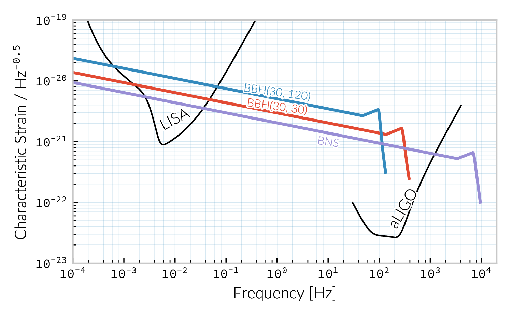
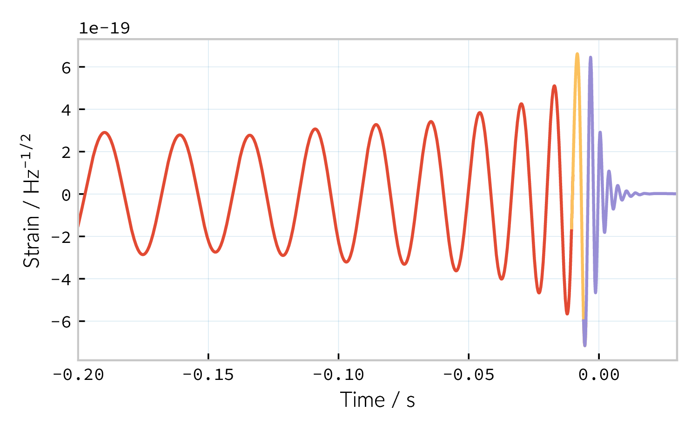
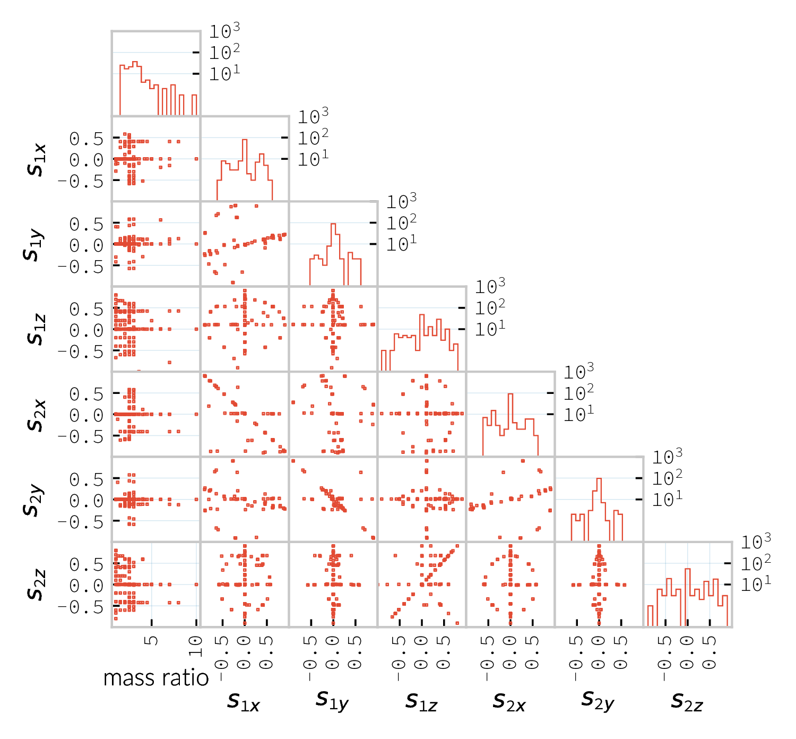
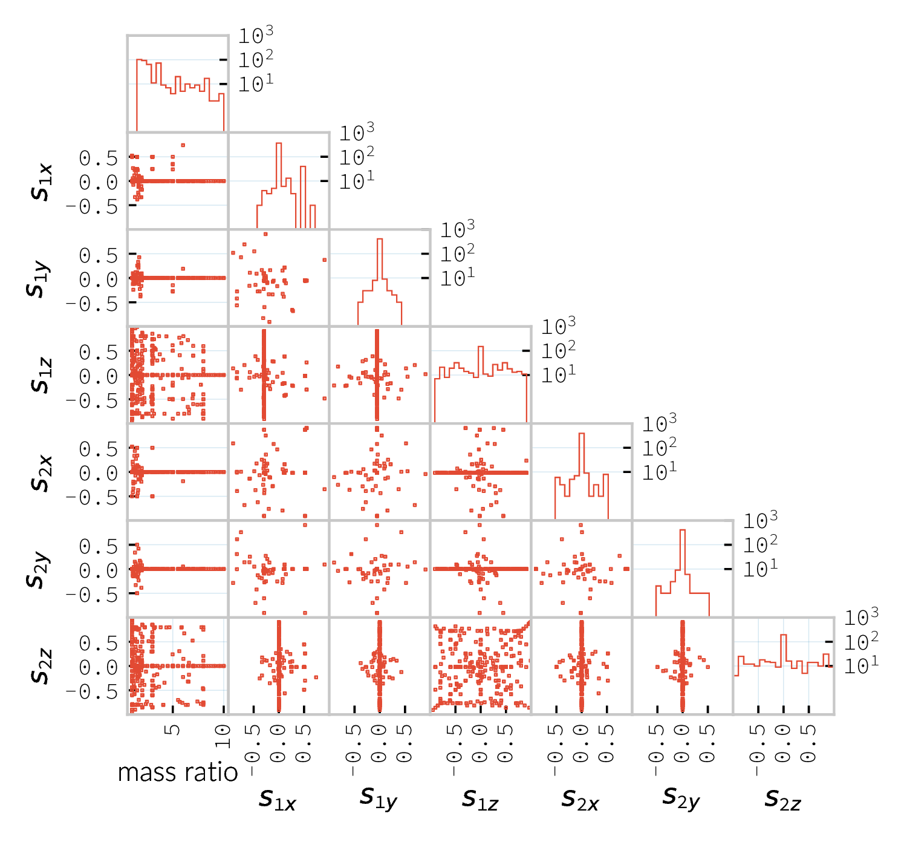

Sources of gravitational waves
##############################

The morphologies of abbr:gw signals can be divided roughly into three categories :cite:`2009LRR....12....2S`, which correspond approximately to the classifications of the astrophysical sources which produce them.

Continuous
    signals are expected to be produced by sources over long periods of time. The primary source of continuous sources for gls:ligo are expected to be abbr:gw pulsars, but in detectors which are sensitive at lower frequencies, such as the proposed gls:lisa mission, the radiation from inspiralling binary systems should also be detectable.
Stochastic
    signals are expected to constitute a background of abpl:gw, produced
    by the black holes at the centres of galaxies
    :cite:`1980Natur.287..307B,2001astro.ph..8028P,2003ApJ...583..616J,2008MNRAS.390..192S`,
    and from the Universe's inflationary period
    cite:1988PhRvD..37.2078A.
Transient
    signals are strong *bursts* of abpl:gw over a period of seconds or
    less. The sources of transient signals are normally further
    sub-divided. *Unmodelled* sources, where there are insufficient
    theoretical models to use matched filtering techniques to search for
    signals in detector data. *Modelled* sources, which currently
    encompass abbr:cbc sources are sufficiently well understood, in
    contrast, to allow the use of matched filter searches. These are
    sources which are primarily expected in the advanced LIGO passband,
    with compact binary coalescences and supernovae being major targets
    for burst searches in the advanced observing runs, however there are
    prospects for burst sources in the gls:lisa regime, for example from
    hyperbolic encounters between compact objects and stars or other
    compact objects :cite:`2012PhRvD..86l4012B,2012PhRvD..86d4017D,2008MPLA...23...99C,2008APh....30..105C,2010MmSAI..81...87D,2005PhRvD..72h4009G,2010PhRvD..82j7501B,2011ApJ...729L..23G`.

Continuous wave sources
=======================

The discovery of pulsars by Bell and Hewish in 1967 was an unexpected
discovery for radio astronomy---objects which produce beams of
radiation, and rotate rapidly. Not long after their discovery it became
apparent that they were a specific form of abpl:ns --- the
tightly-packed remnant of a massive star which has ended its life as a
supernova.

Any rotating mass quadrupole (see equation
ref:eq:intro:gr:mass-quadrupole) will produce abpl:gw as it rotates (see
equation ref:eq:intro:gr:quadrupole2strain), and so it follows that a
dense, massive object, such as a neutron star, will produce abpl:gw as
they rotate, if they possess any mass asymmetry. Further, thanks to
their highly stable rotation speed, the abbr:gw emission from abpl:ns
ought to be produced continuously at a very stable frequency. As abbr:gw
emission occurs in the quadrupole [(2,2)] mode  [1]_, this emission
should be at twice the rotational frequency of the abbr:ns.

The rotation frequency of most pulsars is well-measured by radio
observations, making these attractive prospective sources for
ground-based abbr:gw detectors, such as gls:ligo and gls:virgo. Indeed,
targeted searches for abpl:gw from pulsars at twice their rotation
frequency have been conducted since the \`\`initial'' detector period,
using data from gls:ligo, gls:geo600, and later gls:virgo (which are
summarised in cite:2014ApJ...785..119A), and continued into the advanced
era cite:2017ApJ...839...12A,2019PhRvD..99l2002A.

Pulsar spins are known to decelerate over time, through a process known
as spin-down. This process is often attributed to energy loss through
gravitational radiation. The spin-down limit of a pulsar is the abbr:gw
strain which corresponds to this scenario, where the entirety of the
energy being lost is radiated as abbr:gw, and is defined as

.. raw:: latex

   \begin{equation}
   \label{eq:sources:cw:spindown}
   h = \left( \frac{5}{2} \frac{G I_{zz} | \dot{f} | }{c^{3} d^{2} f } \right)^{\frac{1}{2}},
   \end{equation}

for a pulsar with a spin frequency :math:`f`, moment-of-inertia
:math:`I_{zz}`, at a distance :math:`d` from the observer.

To date no continuous abbr:gw source has been detected, but the failure
to measure abpl:gw from known pulsars has allowed tight limits to be
placed on the ellipticity of 222 known radio pulsars
cite:2019arXiv190208507T, with the tightest limit placed on PSR
J\ :math:`0711\!-\!6830`: :math:`h=1.2\ee{-8}`.

Searches made for pulsars at around twice their rotation frequency were
augmented with targeted searches for emission at the rotation frequency
following the second observing run cite:2019arXiv190208507T. This is
possible if the rotating neutron star is either biaxial or triaxial, and
exhibits free precession. Emission at the rotation frequency may also be
possible in abpl:ns with pinned superfluid interiors
cite:2010MNRAS.402.2503J.

Continuous wave searches can also be used to test abbr:gr, and to place
limits on the parameters of alternative theories of gravity. Searches
for non-tensorial polarisations of abbr:gw were conducted on data from
the first advanced observing run cite:2018PhRvL.120c1104A for all six
potential polarisations allowed in general metric theories.

In comparison to transient signals, the waveforms for continuous wave
sources are generally (semi-)analytical; the waveform model used for the
search for the (2,2)-mode emission in cite:2019arXiv190208507T for
example has the form

.. raw:: latex

   \begin{align}
   \label{eq:sources:cw:signalmodel}
   h_{22}(t) = - C_{22} \big[ & F_{+}^{D}(\alpha, \delta, \psi, t) (1 + \cos^{2} \imath) \cos(2 \Phi(t) + \Phi_{22}^C) \nonumber \\
   + 2 & F_{\times}^{D} (\alpha, \delta, \psi, t) \cos \imath \sin( 2 \Phi(t) + \Phi_{22}^{C} )
   \big] ,
   \end{align}

for :math:`C_{22}` the amplitude of the wave, and :math:`\Phi_{22}^{C}`
its initial phase at some specific time. :math:`\Phi(t)` is the
rotational phase of the source, and :math:`\imath` is the inclination of
the source to the observer. In contrast to the signal from transient
sources, continuous waves can be observed over long periods of time, and
the observed signal will be convolved with the antenna pattern of the
detector, :math:`F_{+,\times}^{D}`, which varies with the sky position
of the source, :math:`(\alpha, \delta)`, the polarisation angle of the
source, and thanks to the relative movement of the source and the
detector, time, :math:`t`.

Stochastic backgrounds
======================

In addition to transient and continuous sources of abpl:gw, which
originate from specific locations in the sky, we expect that a
*background* of abpl:gw should be observable throughout the sky (with an
approximately isotropic distribution). The abbr:gw background is
expected to cover the entire frequency range at some level, from
extremely low frequencies (around an inverse Hubble-time) to frequencies
exceeding :math:`\SI{e14}{\hertz}`.

The abbr:gw background is approximately analogous to the abbr:cmb. This
is the near-isotropic electromagnetic emission discovered in 1964 as
constant background radio emission across the sky
cite:1965ApJ...142..419P, which originates from the epoch of
recombination, when atoms started to form, and the universe became
optically thin.

This abbr:gw would be the result of numerous unresolved and weak
signals, and as a result this background would be continuous and
approximately isotropic cite:2017LRR....20....2R, it is likely to fall
into the part of the measured abbr:gw data which is treated as noise by
the majority of analyses. The noise produced by the detector will be
greater than this signal, and so detection of a background is also
reliant on correlations between a network of detectors. This reliance on
correlations between a network of detectors significantly affects the
sensitivity of the detector network to background sources
cite:PhysRevD.88.124032.

The level of anisotropy in the abbr:cmb implies that the universe today
must be very-nearly flat, and since any curvature would increase as the
universe undergoes metric expansion, this would suggest that the early
universe was even flatter. This poses a dilemma, as a flat universe
requires the energy density of the universe to be equal to a critical
energy density, with a small deviation becoming exagerated over time.
Inflation is an attempt to address this problem, by suggesting that the
universe expanded extremely rapidly early in its evolution, through the
effect of some scalar field. Such a scalar field would be subject to
quantum fluctuations, and tensor fluctuations would be expected to
produce abpl:gw cite:1988PhRvD..37.2078A. abbr:gw production is not
predicted in the early universe by non-inflationary models, and so
discovery of an inflationary abbr:gw background would be strong evidence
for the inflation model cite:2016arXiv160501615C.

First-order phase transitions, which occur when the thermodynamic
properties of a system are discontinuous (such as the sudden,
discontinuous change in the entropy and volume of a liquid as it boils)
could also be responsible for the production of abpl:gw in the early
universe. A number of phase transitions are believed to have occured as,
for example, the strong and electroweak forces decoupled
cite:2016JCAP...04..001C.

Cosmic strings may also be a viable source of background radiation
cite:1997stgr.proc....3A. These are topolgical defects which are caused
by symmetry phase transitions in a number of grand unified theories. As
these defects move they interact with each other to form kinks and
cusps, which can be the source of bursts of gravitational radiation.
Over a sufficiently long period the signals from these events can
superimpose to form apart of the abbr:gw background.

The inspiral of the very large number of compact binary systems in the
universe will also superimpose to contribute to this background
radiation. These systems include galactic white dwarf binaries, which
are expected to produce such a strong signal that they will limit the
sensitivity of the gls:lisa detector, as well as abbr:bbh and abbr:bns
systems cite:2019MNRAS.tmp.2426L,2017CQGra..34x4002R.

Searches for a stochastic background have been made using the data from
the advanced gls:ligo detectors during their first observing run
cite:PhysRevLett.118.121101. To date no evidence of a background have
been identified, which has allowed an upper limit to be placed on its
strength. Additional limits have been placed thanks to astrometric
measurements of active galactic nuclei using radio data and the first
GAIA data release cite:2018ApJ...861..113D, and through pulsar timing
arrays cite:2015MNRAS.453.2576L,PhysRevLett.115.041101.

Compact Binary Coalescences
===========================

.. _figSourcesCBCSpectrum:

   The frequency spectrum of two types of compact binary coalescence—a binary neutron star coalescence, and a binary black hole coalescence—alongside the design sensitivity power spectrum of the Advanced LIGO detector at its design sensitivity.

The moment of inertia tensor of a two-body system will lead to
non-spherical motion within the system, which will in turn produce
gravitational radiation, and gradual orbital decay
cite:1995PhRvL..74.3515B. This effect was first observed in the
Hulse-Taylor pulsar cite:1975ApJ...195L..51H,2005ASPC..328...25W, a
system containing two neutron stars---one of which is a pulsar---which,
through precise pulsar timing measurements, were inferred to be
inspiralling, and producing abpl:gw. This observation was the first
strong, indirect evidence for the reality of abbr:gw production.

The binary system will continue to lose energy via gravitational
radiation until it reaches its *innermost stable circular orbit*, after
which the objects will merge, and eventually coalesce. These coalescence
events are powerful sources of abpl:gw, and the chirp produced by the
coalescence may be sufficiently luminous to be detected by current,
advanced detectors. The frequency spectra of both a binary neutron star
and a binary black hole coalescence are plotted in figure
ref:fig:sources:cbc:spectrum, compared to the sensitivity curve of the
advanced gls:ligo detectors. Attempts to detect signals from such
coalescing systems were also made during the initial run of the
detectors, prior to their being upgraded to advanced gls:ligo and
advanced gls:virgo cite:2012PhRvD..85h2002A. These would be
characterised by the distinct pattern of the pseudo-sinusoidal inspiral
waveform, followed by a bright burst of radiation, and then a sinusoidal
*ringdown* as the post-coalescence remnant vibrates
cite:2009LRR....12....2S. Binary coalescences are thus classified as
transient, or burst sources.

The potential objects which may be involved in an binary coalescence
observable by the current generation of ground-based detectors are black
holes and neutron stars: both compact objects. In the future white dwarf
binaries may also be observable at lower abbr:gw frequencies, and these
systems are expected to be much more abundant than either neutron star
or black hole binaries, but their emission lies within the passband of
gls:lisa ---a planned space-based abbr:gw observatory. These never reach
a last stable orbit, as it lies within their physical diameter, and so
the inspiral component of the waveform is the principle source of
abpl:gw. These are expected to be so numerous in gls:lisa results
cite:2013GWN.....6....4A that entirely new statistical methods will be
needed to process the observations, and to allow observations of other
phenomena to be made in their background.

Glspl:smbbh are believed to collide and merge as part of the merging
processes of galaxies. Again these binaries should produce signals
within the passband of gls:lisa cite:2012CQGra..29l4016A, and should be
so spectacularly strong that they are visible in the gls:lisa data
without the *matched filtering* techniques which are required to extract
other signals from the data cite:2009LRR....12....2S. The observation of
these objects would provide much-needed information about the evolution
of galaxies and of super-massive black holes.

Inspiralling compact binaries can act as a cosmological distance
measure: they have two parameters, their period, and the rate at which
that period changes (which is calculated by measuring the gls:chirp-mass
of the system) which characterise the system, and the amplitude of the
abpl:gw produced is dependent only on the chirp mass of the source, and
the distance from the observer to the object. As a result it is possible
to determine the distance to an inspiralling system simply by
determining the chirp mass and measuring the brightness of the event
cite:2017AnP...52900209A. This would provide an additional means of
measuring cosmic acceleration, and, in the gls:lisa era, this would
allow the measurement of acceleration at high redshift using high-mass
binary black holes.

Dynamics of compact binaries
----------------------------

The dynamics of binary systems are well-understood in Newtonian
mechanics, where the two-body problem can be reduced to a pair of
independent one-body problems. In contrast no exact solutions have been
found to this problem in abbr:gr; while the Schwarzschild solution
cite:1916AbhKP1916..189S is sufficient for some situations where the
mass of one of the two bodies is much smaller than the other (where the
problem is effectively a one body problem) it is insufficient for
systems such as abbp:bbh.

When the two component bodies of the system are at large separation (and
their local velocities are much smaller than the speed of light) a
abbr:pn expansion can be used. In this regime the two objects are
treated as point-particles with slow internal dynamics.

The abbr:pn correction to the Newtonian limit on the order
:math:`\mathcal{O}(1/c^{n})` is generally called the
:math:`(n/2)`-abbr:pn order.

The compact binary waveform
---------------------------

.. _figSourcesCBCbbhCartoon:

   The waveform of a abbr:bbh from the inspiral (highlighted in red), to the merger (yellow), and the ringdown (purple).

The gravitational waveform for a compact binary system can be split into
three broad periods, which are each associated with the dominant energy
loss mechanisms within the system. These are illustrated on a plot of
the time-domain waveform of a abbr:bbh signal in figure
ref:fig:sources:cbc:bbh-cartoon. The first, and longest stage of the
binary's evolution is the *gls:inspiral*. Gravitational radiation
carries energy out of the binary system, causing the orbit to slowly
decay. [2]_ For the majority of the inspiral the abpl:gw produced have a
very low amplitude, and are to weak to be detected by the current
generation of detectors, however this amplitude increases as the radius
of the orbits decrease. Eventually this amplitude becomes observable,
for a period ranging from minutes (in the case of abbr:bns events
cite:2017PhRvL.119p1101A), to fractions of a second (for most abbr:bbh
events cite:2016PhRvL.116f1102A).

As the binary reaches its innermost stable circular orbit the system
evolves from the inspiral period to the merger. At this point the two
black holes *plunge* towards each other, and then coalesce. This period
contains the peak emission of abbp:gw.

Finally, the single black hole which remains will radiate energy through
the *ringdown* period, during which the black hole oscillates, radiating
energy until it becomes a stable Kerr black hole.

Numerical relativity
--------------------

The study of compact binary systems using abpl:gw relies on solving the
relativistic two-body problem; the classical, Newtonian solutions to
this problem are Keplerian orbits, however post-Newtonian gravity
requires that a mass with orbital angular momentum loses energy in the
form of abpl:gw.

The field of abbr:nr, while now capable of producing accurate waveforms
for a wide variety of initial abbr:bbh conditions, had a lengthy period
of development. As recently as 1999 Brügmann cite:1999IJMPD...8...85B
notes that \`\`the binary black hole problem is essentially unsolved''.
The major stumbling-blocks for abbr:nr were specific to abbr:gr. The
first of these is the gauge freedom of the theory, which generally makes
specifying a numerical coordinate grid on the simulated spacetime
impossible in advance. As a result an effective method of producing such
a coordinate grid during the evolution of the numerical simulation must
be employed, which avoids the introduction of coordinate singularities.
Coordinate singularities represented the second major challenge to the
field; in the case of abbr:bbh spacetimes these are typical features.
Additionally, finding a formalism for the representation of the field
equations throughout the evolution of the simulation which would remain
stable had proved challenging.

By the mid-2000s a number of breakthroughs occured. In 2004 Pretorius
cite:2005CQGra..22..425P introduced the \`\`generalised harmonic
coordinate'' formalism which remained stable into the evolution of the
abbr:bbh merger. This was followed cite:2005PhRvL..95l1101P by the
demonstration of an abbr:nr simulation which evolved the abbr:bbh
through the inspiral and merger to the ringdown produced in this
formalism. Late in 2005 Campanelli *et al.* cite:2006PhRvL..96k1101C
demonstrated the use of an algorithm which overcame the difficulties of
coordinate singularities inherent in black hole simulations. These had
previously been overcome through the \`\`excission'' of the black hole,
where a boundary was placed inside the black hole event horizon,
excising its interior, containing the singularity, from the
computational domain. Instead, their technique employed \`\`punctures'',
where the poles which represented the black holes were factored-out
analytically, allowing the production of accurate and complete
waveforms. Also in 2005 Baker *et al.* cite:2006PhRvL..96k1102B
developed a technique for extracting the abbr:bbh waveform directly from
the outer region of the simulation, based on the work of Fiske *et al.*
cite:2005PhRvD..71j4036F.

The covariant nature of the abbp:efe makes choosing a frame of reference
in which to evaluate the metric difficult, and complicates the process
of defining an initial value problem to solve. To get around this the
abbp:efe are often decomposed into a (3+1)-dimensional foliation, in
which the dynamics at each time slice can be solved. A large range of
scales must be resolved within abbr:nr simulations in order to model
both the behaviour of spacetime close to the merging system and at the
location that the abbr:gw is extracted. This range of scales makes
evolving an abbr:nr simulation computationally burdensome, even with
techniques such as adaptive mesh refinement which aim to make this
process efficient. A recent review by Lehner and Pretorius
cite:2014ARA&A..52..661L of the techniques involved in running abbr:nr
simulations summarises a number of the techniques which are used to make
abbr:nr tractable.

The complexity of abbr:nr simulations has lead to their adoption of
parallelisation technology for multiprocessing and message-passing
between processes, however these simulations can still require around a
month to produce on computing clusters containing thousands of
processors.

A number of codes are used to produce abbr:nr waveforms for the
advanced-era abbr:gw detectors:

SPEC
    The abbr:spec is a abbr:nr method which leverages spectral methods
    during the evolution of the black hole spacetime in abbr:bbh
    simulations, in an attempt to circumvent instabilities which are
    present when using finite difference methods
    cite:2000PhRvD..62h4032K.

The code is capable of generating the merger and ringdown component of
the abbr:gw waveform for a generic abbr:bbh configuration
cite:2009PhRvD..80l4010S.

BAM
    The abbr:bam code uses a modified abbr:bssn regime
    cite:2004PhRvL..92u1101B,2008PhRvD..77b4027B,2004PhRvL..92u1101B,1999IJMPD...8...85B.
MAYA
    The MAYA code is based on the abbr:bssn formalism with a moving
    puncture gauge condition cite:2016CQGra..33t4001J.

Catalogues
----------

A number of catalogues of abbr:nr computed abbr:bbh waveforms are
readily available; two of the largest originate from the relativity
group at Georgia Institute for Technology and the SXS collaboration.

Georgia Tech Waveform catalogue
~~~~~~~~~~~~~~~~~~~~~~~~~~~~~~~

The Georgia Tech waveform catalogue cite:2016CQGra..33t4001J is composed
of 452 waveforms which were generated using the MAYA abbr:nr code at the
Centre for Relativistic Astrophysics at Georgia Institute of Technology.
The catalogue includes both non-spinning simulations for quasi-circular
systems with mass-ratios :math:`q \leq 15`, and precessing
quasi-circular systems with :math:`q \leq 8`. Within the set of
waveforms derived from spinning systems are two subsets: aligned-spin,
where the spin axis of each black hole is parallel to the orbital
angular momentum, :math:`\vec{L}`; and precessing, where the spin axes
are not parallel to :math:`\vec{L}`. The distribution of abbr:bbh
parameters for the waveforms in the catalogue are plotted in the corner
plot of figure ref:fig:sources:cbc:nr:gtcoverage.

   The coverage of the Georgia Tech catalogue over the intrinsic physical parameter space of abbr:bbh systems.

SXS waveform catalogue
~~~~~~~~~~~~~~~~~~~~~~

The SXS waveform catalogue
:cite:p:`2013PhRvL.111x1104M`
      ..
	 ,2018arXiv181207865V,2019PhRvL.122a1101V,2016CQGra..33p5001C,2016PhRvD..94f4035A,2016PhRvD..93h4031B`
includes over :math:`400` waveforms, both spinning and non-spinning,
generated using abbr:spec. The coverage of this catalogue is shown in
the corner plot of figure ref:fig:sources:cbc:nr:sxscoverage.

Analytical approximants
-----------------------

The impossibility of producing enough abbr:nr waveforms to densely cover
even the two dimensional parameter space of non-spinning abbr:bbh
systems has lead to the development of algorithms capable of producing
approximations of the waveform across the parameter space. While abbr:pn
approximants provide a powerful approximation to the waveform in the
gls:inspiral phase, as the characteristic velocity of the binary
approaches the speed of light the abbr:pn expansion will lose accuracy,
and an alternative method for approximating the waveform around the
merger is required. There are currently two major implementations of
such approximants; the gls:imrphenom family, and the gls:seobnr family
of approximants.

IMRPhenom
~~~~~~~~~

The gls:imrphenom models cite:2007CQGra..24S.689A take advantage of the
three-component structure of abbr:bbh signals (see
ref:sec:sources:cbc:waveform); calibration waveforms for the models are
produced by a abbr:nr simulation. The calibration waveforms which are
produced by abbr:nr are short, and the inspiral is normally calculated
for only the last few cycles of the binary. In order to make a longer
waveform these abbr:nr waveforms are joined to a abbr:pn inspiral
waveform (since the abbr:pn is known to be a good approximation for this
part of the waveform) in a process called \`\`hybridisation''. For
hybridisation to be effective the abbr:pn and abbr:nr waveforms must be
well-matched. This match is determined by their integrated squared
absolute difference,

.. raw:: latex

   \begin{equation}
   \delta = \int_{t_{1}}^{t_{2}} \left| \ten{h}^{\text{PN}}(t, \vec{\mu}) - a \ten{h}^{\text{NR}}(t, \vec{\mu}) \right|^{2} \dd{t},
   \end{equation}

with :math:`\ten{h}^{\text{NR}}` an abbr:nr waveform,
:math:`\ten{h}^{\text{PN}}` a abbr:pn waveform evaluated at the same
parameters, :math:`a` is an amplitude scaling factor, and
:math:`\vec{\mu}` a vector of extrinsic parameters,
:math:`\vec{\mu} = \{\phi_{0}, t_{0}\}`, the initial phase and start
time of the waveform, respectively cite:2008PhRvD..77j4017A.

The resulting hybridised waveforms are then parameterised in the Fourier
domain. These *phenomenological* waveforms, :math:`u(f)` take the form

.. raw:: latex

   \begin{equation}
   \label{eq:source:cbc:imrphenoma}
   u(f) = A(f) \exp(i \Psi(f) ),
   \end{equation}

for :math:`\Psi` the phase, and with a piecewise function describing the
amplitude, :math:`A` as a function of frequency, :math:`f`:

.. raw:: latex

   \begin{equation}
   \label{eq:sources:cbc:imrphenoma:amp}
   A(f) = C
   \begin{cases}
   (f/f_{\text{merge}})^{-7/6} & \text{if} \ f < f_{\text{merge}} \\
   (f/f_{\text{merge}})^{-2/3} & \text{if}\  f_{\text{merge}} < f < f_{\text{ring}} \\ 
   w \mathcal{L}(f, f_{\mathrm{ring}} , \sigma) & \text{if} \ f_{\text{ring}} < f < f_{\text{cut}}, \\
   \end{cases}
   \end{equation}

where :math:`f_{\text{merge}}`, :math:`f_{\text{ring}}`, and
:math:`f_{\text{cut}}` are respectively the initial merger frequency,
initial ringdown frequency, and the cutoff frequency of the template.
:math:`\mathcal{L}` is a Lorentzian distribution of width
:math:`\sigma`, and :math:`w` is a normalisation constant which describe
the quasi-normal mode frequencies, and :math:`C` is a numerical constant
(details of these parameters can be found in cite:2008PhRvD..77j4017A).

The effective phase, :math:`\Psi`, expanded in powers of :math:`f`, is

.. raw:: latex

   \begin{equation}
   \label{eq:source:cbc:imrphenoma:phase}
   \Psi = 2 \pi f t_{0} + \phi_{0} + \sum_{k=0}^{7} \phi_{k} f^{(k-5)/3},
   \end{equation}

with :math:`\phi_{0}` the phase offset, each of the :math:`\phi_{k}`
values phase parameters, :math:`t_{0}` the arrival time of the waveform.

The amplitude and phase parameters of these phenomenological waveforms
are then determined by fitting the model to around thirty hybridised
waveforms. Finally, the best-matching amplitudes and phases for the
phenomenological waveforms are fitted to the physical parameters of the
binary in order to produce a physically parameterised model.

The first model to take this approach, IMRPhenomA, was calibrated only
against non-spinning hybrid waveforms. Further development produced the
IMRPhenomD model cite:2016PhRvD..93d4007K, which is calibrated against
19 hybrid abbr:pn - abbr:nr waveforms (a mixture of public SXS and
BAM-derived waveforms) to produce aligned-spin spinning waveforms. The
IMRPhenomD model is then verified against 29 additional hybrid
waveforms.

The IMRPhenomP series of waveform models (the most recent of which is
version 3 cite:2018arXiv180910113K) add the ability to model precession
effects within the waveform; for versions 1 and 2 this was limited to
single-spin effects, but version 3 has been designed to allow for
generic abbr:bbh systems. In order to introduce the effects of
precession into the waveform, ``IMRPhenomPv1`` and ``IMRPhenomPv2``
built on the non-precessing waveforms from the IMRPhenomC and IMRPhenomD
families, respectively, and then added the modulations produced in the
waveform by orbital precession. For these first two versions the
precession angles were calculated by a frequency-domain expression which
assumed a single-spin system, under the stationary phase
approximation  [3]_, which is not strictly valid outwith the inspiral
phase. ``IMRPhenomPv3`` uses a two-spin model developed by Chatziioannou
*et al.* cite:2017PhRvD..95j4004C in order to allow for the calculation
of precession angles in generic abbr:bbh systems.

Effective one-body
~~~~~~~~~~~~~~~~~~

An alternative approach to the phenomenological fitting of the
gls:imrphenom algorithms is the abbr:eob approach. The abbr:eob approach
cite:1999PhRvD..59h4006B,2000PhRvD..62f4015B,2009arXiv0906.1769D maps
the dynamics of two compact objects into that of a single test particle
moving in a deformed Kerr metric. In contrast to the piecewise approach
to building the waveform taken in the gls:imrphenom model (see section
ref:sec:sources:cbc:approximants:imrphenom), the abbr:eob approach
constructs the entire waveform in a single process
cite:2011PhRvD..84l4052P. The waveform is constructed by assuming that
the merger is short but with a broad range of frequencies; this section
of the waveform is built by attaching the signal from a plunge signal to
quasinormal modes.

Similarly to gls:imrphenom, the abbr:eob derived waveforms are
calibrated against a number of abbr:nr derived waveforms. For the
non-spinning model, ``EOBv2`` this involved five waveforms produced by
the ``SPEC`` code.

Numerical relativity surrogate models
-------------------------------------

Recently, an entirely different approach to approximating the abbr:bbh
waveform has started to emerge, based on *surrogate modelling*. These
models attempt to directly model abbr:nr waveforms without introducing
phenomenological assumptions, or approximations to abbr:gr, and take
what might be considered a *data-driven*, or statistical approach to the
problem. While the ability to abandon these assumptions and
approximations is attractive, it comes at the expense of requiring a
large number of abbr:nr waveforms with which to condition the model. To
date, there have been two approaches to building such models: those
using spline regression, and those using *Gaussian process regression*.
This section will contain a broad overview of the former, but a thorough
discussion of the latter will be given later in this work (in chapter
ref:cha:gaussian-process).

The NRSur family of surrogate models, developed by Blackman *et al.*
cite:2015PhRvL.115l1102B,2017PhRvD..95j4023B,2017PhRvD..96b4058B employ
spline interpolation to waveforms generated by the ``SpEC`` abbr:nr
code. The two analysis-ready versions of this model, NRSur4d2s and
NRSur7d2s are capable of producing waveforms for systems with a
mass-ratio :math:`<2` and an effective spin-parameter :math:`< 0.8`. In
contrast to phenomenological models, the NRSur models are currently
capable of producing only a small number of cycles of the waveform,
being limited by the length of the abbr:nr waveforms off which they are
conditioned. Recent efforts have been made, however, to produce similar
surrogate models which are conditioned on hybridised waveforms
cite:2018arXiv181207865V. The number of waveforms required to produce
the surrogate model is also considerably larger than those required for
the phenomenological models, with NRSur7d2s being conditioned on 744
abbr:nr waveforms.

An alternative approach to spline surrogate models, which rely on
Gaussian process regression (see chapter ref:cha:gaussian-process) has
recently been shown to be viable cite:2019arXiv190309204W). The
development of these models is discussed in detail in chapter
ref:cha:heron.

Unmodelled and poorly modelled transient sources
================================================

While abbr:cbc searches which are designed to identify well-known signal
morphologies in detector data, *burst* searches are intended to identify
signals either where there is no prior knowledge of the signal
morphology, or where that morphology is poorly modelled.

.. raw:: latex

   \begin{figure}
      \includegraphics[width=\textwidth]{figures/sources/minke-adhoc.pdf}  
      \caption[A catalogue of unmodelled burst waveforms]{The three unmodelled burst ``waveforms'' which are typically considered by burst analyses; Gaussian-like bursts, Sine-Gaussian bursts, and White noise bursts each depicted in the time domain, with both the plus polarisation (red) and cross polarisation (blue) depicted.
      \label{fig:sources:burst:adhoc}
      }
      
   \end{figure}

Parameterisation of burst signals
---------------------------------

While signals from well-defined astrophysical systems, such as abbr:cbc
signals, can be parameterised according to the intrinsic and extrinsic
properties of the generating system, burst signals do not have a
well-defined physical model. As a result we must define a number of
parameters based purely on the properties of the signal.

The first of these is the *Characteristic squared amplitude*,
:math:`|| h^{2} ||`. This quantity is frequently referred to as the
abbr:hrss.

.. raw:: html

   

The characteristic squared amplitude, :math:`|| h^{2} ||`, is defined as

.. raw:: latex

   \begin{equation}
   || h^{2} || = \int_{\infty}^{\infty} | h(t)|^{2} \dd{t} =  \int_{\infty}^{\infty} | \tilde{h}(f) |^{2} \dd{f},
   \end{equation}

for :math:`h(t)` and :math:`\tilde{h}(f)` respectively the strain in the
time, :math:`t`, and frequency :math:`f` representations
cite:2008CQGra..25d5002B.

.. raw:: html

   

For bursts which are well-localised in time we can also define a central
time and a duration.

.. raw:: html

   

The central time, :math:`t_{0}`, is defined as

.. raw:: latex

   \begin{equation}
   t_{0} = \int_{-\infty}^{\infty} t \frac{|h(t)|^{2}}{|| h^{2} ||} \dd{t},
   \end{equation}

and the duration, :math:`\sigma^{2}` is defined

.. raw:: latex

   \begin{equation}
   \sigma^{2} = \int_{-\infty}^{\infty} (t-t_{0})^{2} \frac{|h(t)|^{2}}{|| h^{2} ||} \dd{t}.
   \end{equation}

.. raw:: html

   

Equivalently, for bursts well-localised in frequency we can define a
central frequency and a bandwidth.

.. raw:: html

   

The central frequency, :math:`f_{0}`, is defined as

.. raw:: latex

   \begin{equation}
   f_{0} = \int_{-\infty}^{\infty} f \frac{|h(f)|^{2}}{|| h^{2} ||} \dd{f},
   \end{equation}

and the duration, :math:`b^{2}` is defined

.. raw:: latex

   \begin{equation}
   b^{2} = \int_{-\infty}^{\infty} (f-f_{0})^{2} \frac{|h(f)|^{2}}{|| h^{2} ||} \dd{f}.
   \end{equation}

.. raw:: html

   

We can also define a *quality factor*, :math:`Q` for a burst.

.. raw:: html

   

The quality factor, :math:`Q`, of a burst signal is defined as

.. raw:: latex

   \begin{equation}
           \label{eq:sources:burst:quality}
       Q = f^2_{0} / b^{2}.
   \end{equation}

.. raw:: html

   

Gaussian bursts
---------------

Perhaps the simplest conceivable model of a burst of abpl:gw is one
where energy is emitted across a broadband range of frequencies over a
fixed period of time, with a smooth rise and decay in amplitude. Such a
source can be modelled as with a Gaussian function, and may be a
suitable model for broadband sources, such as the core-bounce during a
core-collapse abbr:sn.

In searches the model for such a signal is

.. raw:: latex

   \begin{equation}
      \label{eq:sources:burst:waveforms:gaussian}
      h(t) = A \exp\left( - \frac{ (t - t_{0})^{2} }{ 2 \sigma^{2} } \right),
   \end{equation}

for a strain :math:`h` at time :math:`t`, with an amplitude :math:`A`,
central time :math:`t_{0}` and duration :math:`\sigma`.

An example of a Gaussian burst waveform
(:math:`\sigma = \SI{0.01}{\second}`, :math:`A = 1\ee{-21}`, and
:math:`t_{0} = \SI{100}{\second}`) is plotted in the left column of
figure ref:fig:sources:burst:adhoc. In this figure the two polarisations
of the signal are plotted, with only the plus polarisation containing
abbr:gw power for this morphology.

Sine-Gaussian bursts
--------------------

In addition to searching for broadband, time-constrained bursts of
abbr:gw energy, some sources are expected to produce abpl:gw which are
in a confined range of frequencies, in addition to being released over a
short time-span. Such a source can be approximated by a sinusoidal
signal which is enveloped by a Gaussian rise and decay in amplitude. The
model used in gls:ligo searches for such signals is:

.. raw:: latex

   \begin{equation}
      \label{eq:sources:burst:sinegaussian}
      h(t) = A \exp \left[ \frac{ - 2(t - t_{0})^{2} \pi^{2} f^{2}}{Q^{2}} \right] \cos\left[ 2 \pi f (t - t_{0}) \right],
   \end{equation}

for a strain :math:`h` at time :math:`t`, with :math:`A` the amplitude
of the signal, :math:`t_{0}` its central time, :math:`Q` the quality
factor of the burst, and :math:`f` is frequency.

An example of a time-domain sine-Gaussian burst signal(\ :math:`q = 8`,
:math:`f = \SI{100}{\hertz}`, :math:`A = 1\ee{-21}`, and
:math:`t_{0} = \SI{100}{\second}`, with linear polarisation) is plotted
in the middle column of figure ref:fig:sources:burst:adhoc, with the
plus- and cross-polarised waveforms both shown.

White noise bursts
------------------

Astrophysical processes are unlikely to produce emission at a single
frequency, or with a smooth evolution of amplitude, and so searches are
normally expected to be sensitive to band-limited white noise bursts,
which consist of band-limited uncorrelated noise within a Gaussian
amplitude envelope. An example of a time-domain white noise burst (with
duration :math:`\SI{0.05}{\second}`, :math:`f = \SI{1000}{\hertz}`,
:math:`A = 1\ee{-21}`, and :math:`t_{0} = \SI{100}{\second}`, with
linear polarisation) is plotted in the right column of figure
ref:fig:sources:burst:adhoc, with the plus- and cross-polarised
time-domain waveforms both shown.

Ringdown-like bursts
--------------------

Ringdown-like signals, with a sudden rise, and exponential decay in
amplitude are expected in the post-merger signal of abbr:cbc systems,
and in some models of neutron star model excitation
cite:2004PhRvD..70l4015B. These take the form

.. raw:: latex

   \begin{equation}
      \label{eq:sources:burst:ringdown}
      h(t) = \exp (-t / \tau) \sin( 2 \pi f t)
   \end{equation}

for a strain :math:`h` at time :math:`t`, given a decay time
:math:`\tau` and frequency :math:`f`.

Core-collapse supernovae
------------------------

.. raw:: latex

   \begin{figure}
   \includegraphics{figures/sources/source-ccsn.pdf}
   \caption[Frequency ranges for supernovae compared to the advanced LIGO and DECIGO sensitivity curves]{The frequency ranges and approximate abbr:gw amplitudes likely to be produced by core collapse supernovae~\cite{2008PhRvD..78f4056D} and Type 1A supernovae~\cite{2015PhRvD..92l4013S}, at a distance of $\SI{10}{\kilo pc}$ from the earth. 
   The noise (sensitivity) curve of the advanced gls:ligo, gls:decigo, and gls:lisa detectors at their design sensitivity is plotted for reference.}
   \label{fig:sources:sn-spectrum}
   \end{figure}

The collapse of a massive star's core is driven by the release of
gravitational energy, creating a abbr:ccsn. The progenitor stars of
abpl:ccsn have zero-age-main-sequence (ZAMS) masses in the range
:math:`8\,\msolar \leq M \leq 130\,\msolar`. Much of this energy is
stored as heat in the abbr:pns remnant, around 99% of the released
energy is carried-off by neutrinos, around 1% provides the kinetic
energy of the explosion, while less than :math:`0.01\%` of the energy is
extracted as electromagnetic and gravitational radiation
cite:2009CQGra..26f3001O.

When the iron core of a star exceeds the Chandrasekhar mass it becomes
unstable, and undergoes gravitational collapse, and is compressed until
the neutron degeneracy pressure is able to halt the collapse. At this
point the core becomes stiff, and the inner core rebounds---a phase of
the supernova known as \`\`core bounce''. The stiff, ultra-dense remnant
of the collapse is a abbr:pns, and the rebounding material forms a shock
wave. This shock wave is not sufficient, however, to produce the
observed explosive phase of abpl:ccsn events, and so must undergo
*revival* by some poorly-understood mechanism to lead to the final
explosion. abpl:gw are expected to be emitted in a number of periods
during the collapse, for example during a rotating collapse, and the
core-bounce which follows it; pulsations of the PNS
:raw-latex:`\cite{1966ApJ...145..514M}`; and anisotropic neutrino
emission
cite:1979ApJ...231Q.644E,1978ApJ...223.1037E,1978Natur.274..565T.

In order to predict the gravitational waveforms which would be produced
by a abbr:ccsn detailed numerical modelling must be completed, with the
most modern results from Scheidegger cite:2010CQGra..27k4101S, modelling
rotating, axisymmetric collapses in three dimensions, and Dimmelmeier
cite:2008PhRvD..78f4056D in two dimensions. Those from Müller
cite:2019MNRAS.484.3307M and Ott cite:2013ApJ...768..115O model
neutrino-driven supernovae in three dimensions.

It is possible that nearby core-collapse supernovae could have been
detected with the initial LIGO detector cite:2009LRR....12....2S,
although none were. At design sensitivity the three-detector network of
Advanced gls:ligo and Advanced gls:virgo should be able to detect
abpl:ccsn to a distance of :math:`\SI{5.5}{\kilo\parsec}`, but with
large uncertainties, in the case of neutrino-driven explosions, while
rapidly-rotating core-collapses will be detectable to
:math:`\SI{50}{\kilo\parsec}`, the distance to the Large Magellanic
Cloud. Extreme emission scenarios may be detectable as far as
:math:`\SI{0.77}{\mega pc}`, the distance to M31
cite:2016PhRvD..93d2002G. The characteristic strain spectrum of a
abbr:ccsn is plotted in figure ref:fig:sources:sn-spectrum, alongside
the sensitivity curve of both advanced gls:ligo and two proposed
space-based detectors, gls:decigo and gls:lisa.

Cosmic strings
--------------

Cosmic strings are theorised topological defects which were first
postulated by Kibble in 1976 cite:1976JPhA....9.1387K. These are
expected to have been produced as a result of phase transitions in the
early universe, and carry large quantities of energy. The simplest
string models are characterised by the energy density of the string
:math:`\mu`, and its tension, which are taken to be equal. The
dimensionless quantity
:math:`G\mu \sim (T_{\text{c}} / M_{\text{Pl}})^{2}`, with :math:`G`
Newton's gravitational constant, :math:`T_{\text{c}}` the temperature at
the transition, and :math:`M_{\text{Pl}}` the Planck mass, characterises
the strength of interactions between strings. For strings produced by
the decoupling of the strong force from the electroweak force this
quantity has a value on the order of :math:`10^{-6}`, so a quantity
:math:`\mu_{6}` is often defined as a shorthand
cite:1995RPPh...58..477H.

Three separate models of cosmic strings have been searched for in data
from the advanced gls:ligo detectors to date, and while no evidence for
abbr:gw emission from these objects was found, it was possible to place
limits both on the parameters of the various models and on the scale of
:math:`G \mu`. The gls:ligo results place a limit of :math:`G \mu` be
less than :math:`\num{4.2E-10}` :raw-latex:`\cite{2019PhRvD.100b4017A}`,
which agrees with, but is surpassed by results from pulsar timing
arrays, which find :math:`G \mu` is less than :math:`\num{5.7e-12}`
:raw-latex:`\cite{2018PhRvD..97j2002A}`.

Parabolic and hyperbolic encounters
-----------------------------------

Encounters between pairs of black holes, where the two bodies
trajectories are affected by the total gravitational field, but where a
closed orbit is not formed are expected to be possible in regions of
space with a high density of compact objects, for example globular
clusters and the centres of galaxies. In the case where the deflection
angle of the trajectories is small this process can be considered
analogous to Bremsstrahlung processes in electromagnetic radiation
production cite:PhysRevD.1.1559,1978ApJ...224...62K, but the emission
production becomes more complicated as larger deflection angles are
considered, and spin is included. Approximate models are available for
the waveforms of these encounters in the Bremsstrahlung case,
low-velocity cases with arbitrary deflection cite:1977ApJ...216..610T,
and head-on collisions cite:1992PhRvD..46..694D. Recent advances have
allowed the production of 3.5 abbr:pn accurate waveforms for hyperbolic
encounters for non-spinning pairs of black holes
cite:2018PhRvD..98b4039C

Encounter waveforms
~~~~~~~~~~~~~~~~~~~

Recent advances in abbr:nr modelling have allowed the production of
accurate waveforms for parabolic encounters between spinning black
holes, and in this section I present the results of a study I have
conducted to consider the detectability of some of these waveforms in
current and future detectors. The waveforms for this brief study are
taken from the abbr:gw driven capture simulations of
cite:2017PhRvD..96h4009B. An example of one of these waveforms is
plotted in figure ref:fig:sources:burst:parabolic:waveform.

.. raw:: latex

   \begin{figure}
       \includegraphics{figures/sources/hyperbolic-timeseries.pdf}
       \caption[Parabolic enounter waveform]{A parabolic encounter waveform from~\cite{2017PhRvD..96h4009B} for a system with mass-ratio $q=4$, an impact parameter of $\SI{5060}{\solMass}$, and a total mass of $\SI{50}{\solMass}$ at a distance of $\SI{50}{\mega\parsec}$. 
   The behaviour of this waveform at times after the main burst of strain indicates that additional high-pass filtering is required when making calculations using the timeseries thanks to the existence of low-frequency artifacts which prevent the waveform returning to zero at large times.
       The spectrum of this waveform is plotted in figure~\ref{fig:sources:burst:parabolic:spectrum}.
       \label{fig:sources:burst:parabolic:waveform}}
   \end{figure}

.. raw:: latex

   \begin{figure}
       \includegraphics{figures/sources/hyperbolic-spectrum.pdf}
       \caption[Parabolic enounter waveform]{The spectrum of a parabolic encounter from~\cite{2017PhRvD..96h4009B} for a system with mass-ratio $q=4$, an impact parameter of $\SI{5060}{\solMass}$, and a total mass of $\SI{50}{\solMass}$ at a distance of $\SI{50}{\mega\parsec}$ (the same waveform depicted in figure~\ref{fig:sources:burst:parabolic:waveform}), with the sensitivity curves of gls:ligo, gls:decigo, gls:einstein-telescope, and gls:lisa for reference. 
       The timeseries representation of this waveform is plotted in figure~\ref{fig:sources:burst:parabolic:waveform}.
       \label{fig:sources:burst:parabolic:spectrum}}
   \end{figure}

The detectability of the waveforms can be estimated using equation
ref:eq:intro:snr, taking the Fourier transform of the strain data from
the abbr:nr simulation to form :math:`\tilde{h}(f)`, and the estimated
noise abbr:asd for each detector. Figure
ref:fig:sources:burst:parabolic:distance shows the abbr:snr of the
waveform plotted in figure ref:fig:sources:burst:parabolic:waveform as a
function of the luminosity distance of the source, and the total mass of
the system. An abbr:snr of 8 is a standard threshold which a signal must
exceed to be considered a detection, and this is plotted with a heavier
line. The spectrum of this waveform is plotted in figure
ref:fig:sources:burst:parabolic:spectrum, alongside the abbr:asd for
advanced gls:ligo (at design sensitivity), abbr:et, and gls:decigo. This
plot clearly shows that a signal from a system such as this at a
distance of :math:`\SI{50}{\mega\parsec}`, a distance which encompasses
not only the Local group, but nearby galaxy clusters such as the Virgo
group, is above the noise-floor of even advanced gls:ligo at its design
sensitivity. Other systems, which are highly asymmetrical (with a
mass-ratio :math:`q = 16`) may be even more promising candidates for
detection in advanced gls:ligo. For example the waveform used to produce
figure ref:fig:sources:burst:parabolic:distance2, with a distance around
:math:`\SI{175}{\mega\parsec}`; again producing a detectable abbr:snr to
distances which encompass nearby clusters of galaxies. This makes these
events a promising burst source candidate, however further work is
required to establish plausible astrophysical rates for such events in
order to determine if these are a likely source of signals for current
generation detectors.

Encounters which result in capture may appear similar to high-mass
abbr:bbh events in the current generation of detectors, since the
inspiral portion of a high-mass system will be predominately at
frequencies below which the detectors are sensitive. Encounter waveforms
will also lack a lengthy inspiral portion; as a result there is a chance
that future abbr:gw events may be misclassified, and this eventuality
should be considered in waveforms which seem to lack a clear inspiral.
These results are principally low-frequency sources, and as such are
ideal candidates for both abbr:et, which aims to achieve much greater
low-frequency sensitivity than current detectors, but also for decihertz
detectors, such as gls:decigo.

.. raw:: latex

   \begin{figure}
       \includegraphics{./figures/sources/hyperbolic-m4-l0d8.pdf}
       \caption[The signal-to-noise ratio of a hyperbolic encounter waveform in advanced LIGO]{The abbr:snr of the $q=4$ hyperbolic encounter waveform plotted in figure \ref{fig:sources:burst:parabolic:waveform} in advanced abbr:ligo at design sensitivity.
       The heavy line for an abpl:snr of 8 represents a standard detection threshold used in single detector transient searches.
       \label{fig:sources:burst:parabolic:distance}}
   \end{figure}

.. raw:: latex

   \begin{figure}
       \includegraphics{./figures/sources/hyperbolic-m16-l0d24.pdf}
       \caption[The signal-to-noise ratio of a hyperbolic encounter waveform in advanced LIGO]{The abbr:snr of a $q=16$ hyperbolic encounter waveform in advanced abbr:ligo at design sensitivity.
       The heavy line for an abpl:snr of 8 represents a standard detection threshold used in single detector transient searches.
       \label{fig:sources:burst:parabolic:distance2}}
   \end{figure}

.. [1]
   In abbr:gr, at least.

.. [2]
   This in fact occurs in *all* orbits, however most objects will not
   get close enough that the current generation of detectors will be
   able to observe the low-amplitude radiation produced by such systems.
   In the future, however, inspirals of objects such as white dwarf
   binaries are expected to be noise sources for space-based detectors,
   such as gls:lisa.

.. [3]
   The stationary phase approximation is found to provide sufficient
   accuracy for the matched-filtering processes which are common in
   abbr:gw data analysis. cite:1999PhRvD..59l4016D
